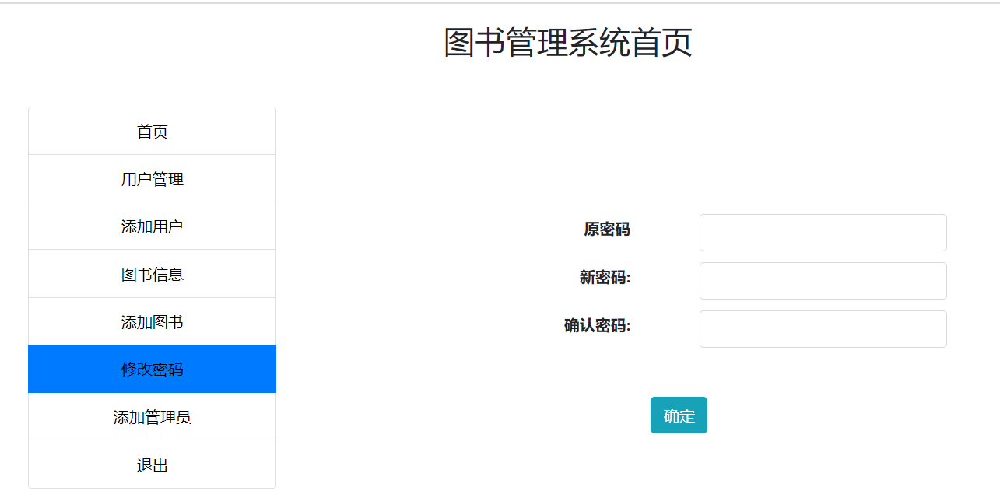

## 基于JSP+Servlet实现的图书管理系统

###  获取sql数据库文件: 从戎源码网 (https://armycodes.com/) QQ: 386869957 QQ群: 377586148
###  所有系统地址: (https://github.com/YuLin-Coder/AllProjectCatalog) 
###  所有项目以及源代码本人均调试运行无问题 可支持远程安装部署调试、定制修改、代码讲解

## 项目介绍
基于JSP+Servlet实现的图书管理系统，主要功能如下

【管理员】功能：

用户管理：管理员可以查看用户列表，编辑用户信息，删除用户等操作。
图书管理：管理员可以添加、编辑、删除图书信息，包括图书封面、作者、出版社、ISBN号、简介等。
借阅记录管理：管理员可以查看借阅记录，处理借阅请求，审核归还和续借请求等操作。
系统设置：管理员可以进行系统配置，如设置借阅期限、图书上架下架等。

【普通用户】功能：

用户注册和登录：普通用户可以注册新账号并登录系统。
图书查询：用户可以根据图书名称、作者、分类等条件进行图书的搜索和查询。
图书详情：用户可以查看图书的详细信息，包括图书封面、作者、出版社、ISBN号、简介等。
图书借阅：普通用户可以借阅图书，需要提供借阅日期和归还日期。
图书归还：普通用户可以归还借阅的图书。
图书续借：普通用户可以续借借阅的图书。

## 项目技术
- 编程语言：Java
- 数据库：MySQL
- 前端技术：JSP、JavaScript、bootstrap、JQuery
- 后端技术：Servlet、JDBC

## 运行环境
- JDK版本：JDK1.8及以上
- 开发工具：IDEA、Ecplise、Myecplise都可以
- 数据库: MySQL5.7及以上

## 运行截图

